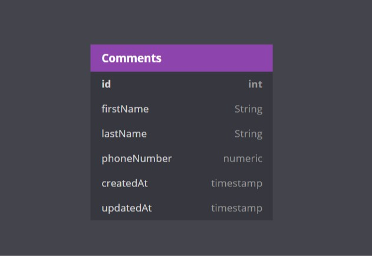

# Contact List - Deno

> This is a contact list app built with denojs, vuejs & mongodb.

## Features

> CRUD (Create, Read, Update And Delete)

- CRUD operation for contacts

## API Documentation

Extensive and testing documentation with postman: [Contact list API](https://documenter.getpostman.com/view/9407876/SzmmUEYg?version=latest)

## Database Model

Though the diagram uses sql data type, this diagram is to show you the various collections in the mongo database.



## Requirement

- DenoJS
- MongoDB

## Installation

Install deno [installation](https://deno.land/manual/getting_started/installation)

```console
npm install
```

Install denon it's like nodemon

```console
deno install -Af --unstable https://deno.land/x/denon/denon.ts
```

## Start web server

```console
denon app.ts
```

## License

This project is licensed under the MIT License

## Developed by Reagan Ekhameye (Tech Reagan)

Reach me on twitter [@techreagan](https://www.twitter.com/techreagan)
